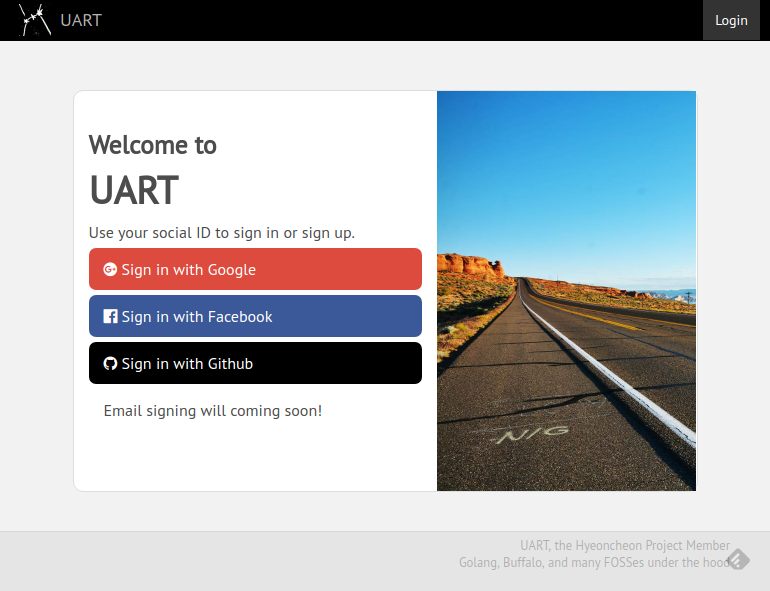
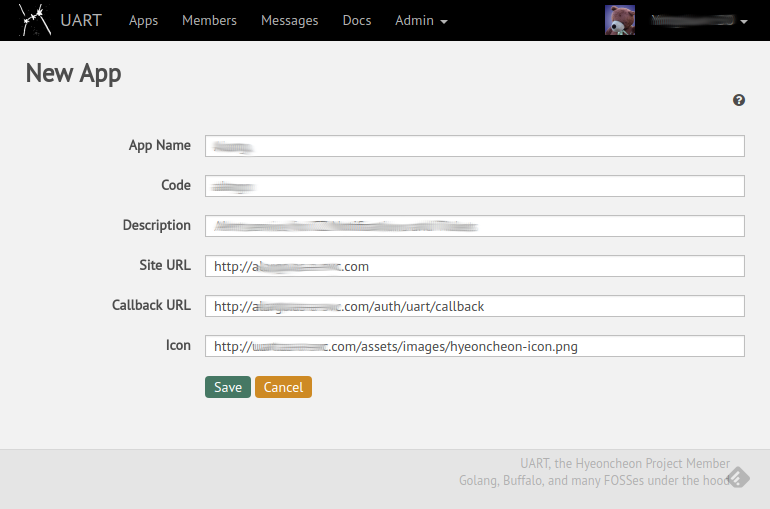
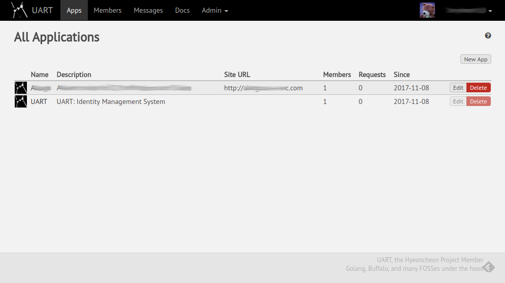
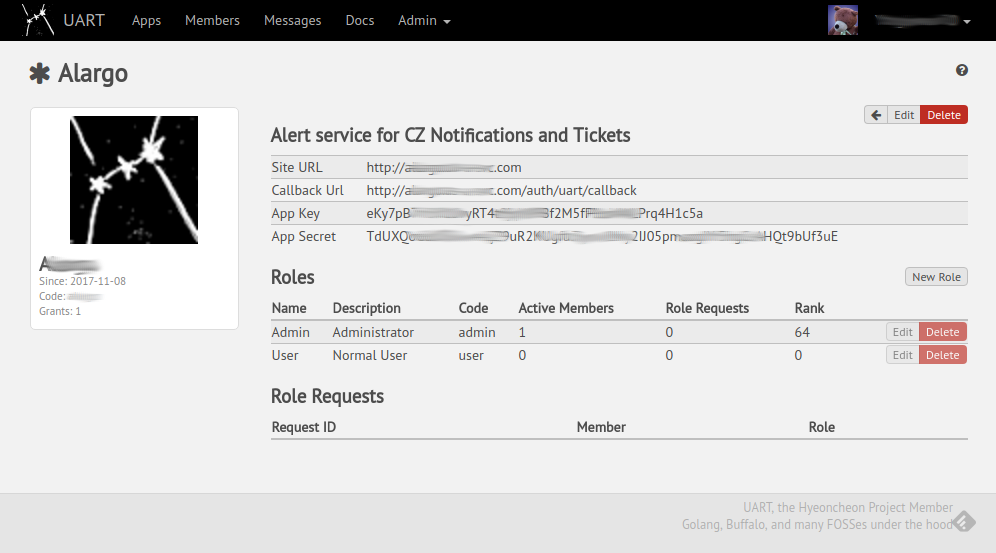
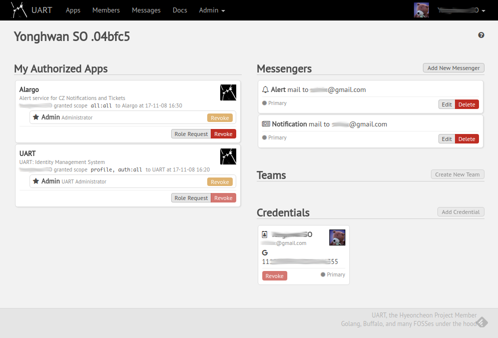

# It's UART

[](https://travis-ci.org/hyeoncheon/uart)
[](https://goreportcard.com/report/github.com/hyeoncheon/uart)
[](https://codeclimate.com/github/hyeoncheon/uart/maintainability)
[](https://codeclimate.com/github/hyeoncheon/uart/test_coverage)
[](https://coveralls.io/github/hyeoncheon/uart?branch=master)

UART is an Universal Authorizaion, Role and Team management service software.

UART was developed to succeed my old SiSO project, the original SSO service
for Hyeoncheon Project. (which was developed with Ruby on Rails framework
with well known Devise, OmniAuth and other open source components.)

UART is written in Go Language and also is built upon many open source
software modules including
[OSIN OAuth2 server library](https://github.com/RangelReale/osin)
and powered by open source
[Buffalo Go web development eco-system](https://github.com/gochigo/buffalo).

## Feature

The main features are below:

* Support sign on/in with social network accounts
  * currently Google, Facebook, and Github accounts are allowed.
* (Future Plan) Email address based local authentication will be added soon.
  * This will be used as One-Time-Password option for other authentication.
* Work as OAuth2 Provider to act as SSO authenticator for family projects.
* OAuth2 Client App management with optional role based authorization.
  * Role management per each apps.
* Support standard OAuth2 authorization process.
  * The format of Access Token is JWT(JSON Web Token).
  * Also provide `/userinfo` API endpoint.
* Member management and per App roles.

## Install

Installation procedure for Ubuntu Linux.

### Requirement

#### Essential Build Environment

```console
$ sudo apt-get update
$ sudo apt-get install build-essential
$ 
```

#### Install Golang

```console
$ sudo mkdir -p /opt/google
$ cd /opt/google/
$ wget -nv https://storage.googleapis.com/golang/go1.8.3.linux-amd64.tar.gz -O - |sudo tar zx
$ sudo mv go go-1.8.3
$ sudo ln -s go-1.8.3 go
$ cat >> ~/.bashrc <<EOF
> 
> ## GOLANG
> export GOPATH="\$HOME/go"
> export GOROOT="/opt/google/go"
> export PATH="\$PATH:\$GOPATH/bin:\$GOROOT/bin"
> 
> EOF
$ 
$ # source bashrc or restart the shell
$ mkdir $GOPATH
$ cd $GOPATH
$ 
```

#### Install Node.js with nvm

```console
$ curl -o- https://raw.githubusercontent.com/creationix/nvm/v0.33.2/install.sh | bash
$ 
$ # source bashrc or restart the shell
$ nvm --version
0.33.2
$ nvm ls-remote --lts |tail -2
        v6.11.1   (LTS: Boron)
        v6.11.2   (Latest LTS: Boron)
$ nvm install lts/boron
$ node --version
v6.11.2
$ npm --version
3.10.10
$ 
```


### Get and Build UART

#### Get Source

```console
$ mkdir -p $GOPATH/src/github.com/hyeoncheon
$ cd $GOPATH/src/github.com/hyeoncheon
$ git clone https://github.com/hyeoncheon/uart.git
$ cd uart
$ 
```

#### Vendoring with Godep

```console
$ go get -u github.com/golang/dep/cmd/dep
$ dep ensure
$ 
```

#### Get Buffalo and Build

```console
$ go get -u github.com/gobuffalo/buffalo/buffalo
$ npm install --no-progress
$ buffalo build --static
$ ls bin/uart
$ 
```

#### Install Files

```console
$ scripts/keygen.sh
$ mkdir -p $UART_HOME
$ install bin/uart $UART_HOME
$ cp -a messages files locales templates $UART_HOME
$ cp -a uart.conf $UART_HOME
$ cp -a supports/uart.service $UART_HOME
$ 
```

and register it as system service

```console
$ sudo ln -s /opt/hyeoncheon/uart/uart.service /etc/systemd/system/
$ sudo systemctl is-enabled uart
linked
$ 
```


## Setup and Run

### Configure Database

For development,

```console
$ buffalo db create && buffalo db migrate
$ 
```

or 

```console
$ GO_ENV=production buffalo db create && GO_ENV=production buffalo db migrate
$ 
```

for production.


### Run

```console
$ sudo systemctl start uart
$ sudo systemctl status uart
● uart.service - UART server
   Loaded: loaded (/opt/hyeoncheon/uart/uart.service; linked; vendor preset: enabled)
   Active: active (running) since Wed 2017-11-08 19:03:54 KST; 30min ago
 Main PID: 15264 (uart)
    Tasks: 8
   Memory: 7.7M
      CPU: 352ms
   CGroup: /system.slice/uart.service
           └─15264 /opt/hyeoncheon/uart/uart

<...>
$ 
```


## OK, Show Me the Shots

#### Login Screen



#### Register New App



#### Registered Apps



#### App Details



#### Membership




## TODO

## Author

Yonghwan SO https://github.com/sio4

## Copyright (GNU General Public License v3.0)

Copyright 2016 Yonghwan SO

This program is free software; you can redistribute it and/or modify it under
the terms of the GNU General Public License as published by the Free Software
Foundation; either version 3 of the License, or (at your option) any later
version.

This program is distributed in the hope that it will be useful, but WITHOUT
ANY WARRANTY; without even the implied warranty of MERCHANTABILITY or FITNESS
FOR A PARTICULAR PURPOSE. See the GNU General Public License for more details.

You should have received a copy of the GNU General Public License along with
this program; if not, write to the Free Software Foundation, Inc., 51
Franklin Street, Fifth Floor, Boston, MA 02110-1301 USA

